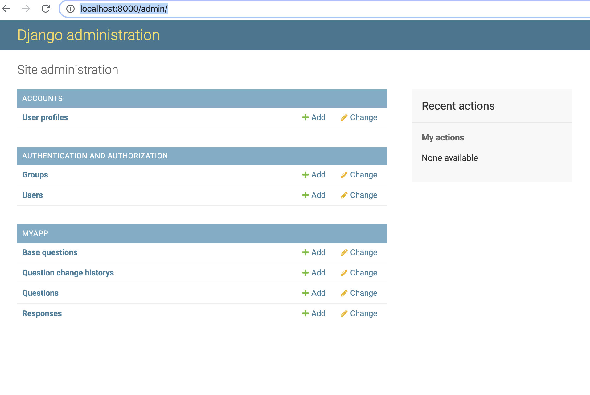
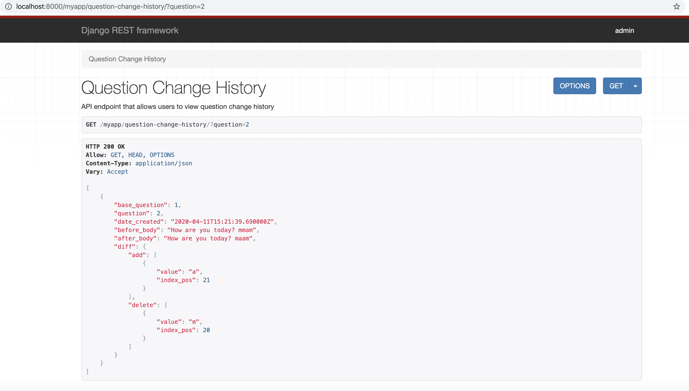
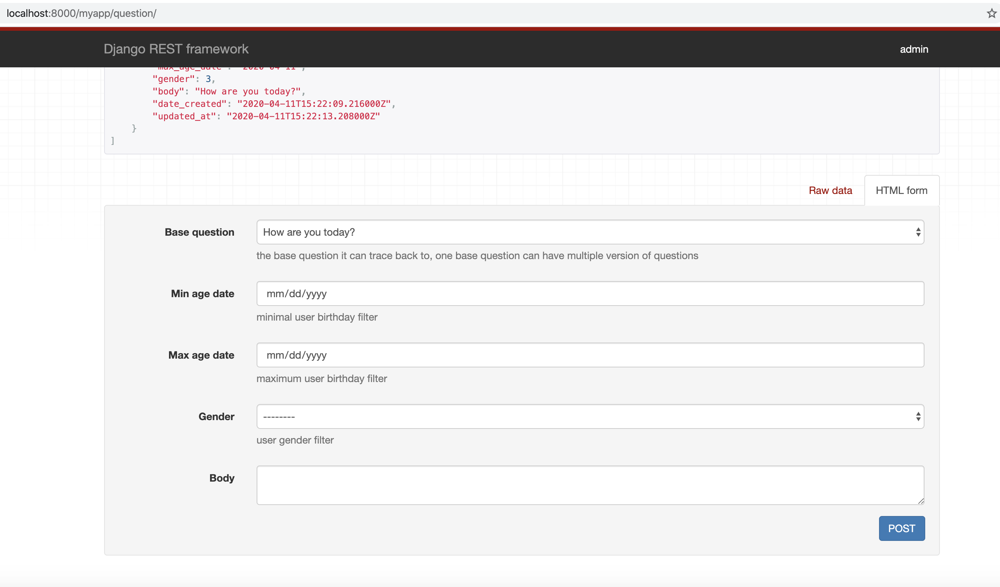

# A Django chatbot project
A collection of Django chatbot project that will help bootstrap your next Django web
chatbot application.

## Structure
In order to have communication between a chatbot and a user, the domain/db will follow the following structure:
- Account
    - User: track user login information
    
    - UserProfile: track user metadata such as age and gender, which can help customize question
- Chat (MyApp)
    - BaseQuestion: the original question which all customized questions can track back to. Each base question has topic associate to it to categorize the question.
    - Question: the customized question based off configuration such as user age and gender. Each question has base question to trace back to.
    - Response: user response to a Question object.

    - QuestionChangeHistory: a entity to record the change history of a base question or question, it may help to see how question get customized over time.

## Pre-requirement
- Python 3.7 +
    - library: virtualenv
- Docker (Optional)

## Installation
You can run this locally or on Docker

#### First
```
mkdir your_dir
cd your_dir
git clone #repo
cd django_chat_project
source app/env/bin/activate
```
#### Run on docker
```
# update permission locally
chmod +x app/entrypoint.sh
# build docker image and run
docker-compose up -d --build
# load fixture data (optional), it will create the superuser too
docker-compose exec web python manage.py loaddata fixture_data.json
# if you did not choose to load the fixture data, create superuser
docker-compose exec web python manage.py createsuperuser
```

#### Run locally
```
cd app
pip install -r requirements_local.txt
# create db
psql
CREATE USER local_user WITH PASSWORD 'password123';
CREATE DATABASE django_chat WITH OWNER local_user;
# load fixtures data (optional)
python manage.py loaddata fixture_data.json
# if did not run loaddata, then create superuser mannually
python manage.py createsuperuser
python manage.py runserver
```
go to http://localhost:8000/admin

`username: admin ` `password: password123` 



## Access through API
There are three endpoints for access chatbot data
- /myapp/question/
    * allowed method: [GET, POST]
    * query_param:
        * base_question: base_question_id
- /myapp/base-question/
    * allowed method: [GET, POST]
- /myapp/question-change-history/
    * allowed method: [GET]
    * query_param:
        * base_question: base_question_id
        * question: question_id

##### examples:
http://localhost:8000/myapp/question-change-history/?question=2



http://localhost:8000/myapp/question/



## Access through command
There are two commands in this repo
- add_base_question - create a base question
- get_question_change_history - get change history of one question
##### examples:
```
python manage.py add_base_question body="this is a new question" topic="information" -rt 1
(docker) docker-compose exec web python manage.py add_base_question body="this is another new question" topic="information"
(docker) docker-compose exec web python manage.py get_question_change_history -q_id=1
```
result
```
(env) user@computer app % docker-compose exec web python manage.py get_question_change_history -q_id=1
[OrderedDict([('base_question', 1), ('question', 1), ('date_created', '2020-04-11T15:10:56.755000Z'), ('before_body', 'How do you feel today? sir'), ('after_body', 'How are you today? sir'), ('diff', {'add': [{'value': 'a', 'index_pos': 6}, {'value': 'r', 'index_pos': 7}, {'value': 'e', 'index_pos': 8}], 'delete': [{'value': 'd', 'index_pos': 4}, {'value': 'o', 'index_pos': 5}, {'value': ' ', 'index_pos': 13}, {'value': 'f', 'index_pos': 14}, {'value': 'e', 'index_pos': 15}, {'value': 'e', 'index_pos': 16}, {'value': 'l', 'index_pos': 17}]})])]
```

## Additional Notes:
The project is using **signal**(https://docs.djangoproject.com/en/3.0/ref/signals/) to track the question change history.
Whenever a BaseQuestion or a Question record changed, it will create a record in QuestionChangeHistory table.

## TODO
1. Writing Unit test
2. Writing test for the endpoints